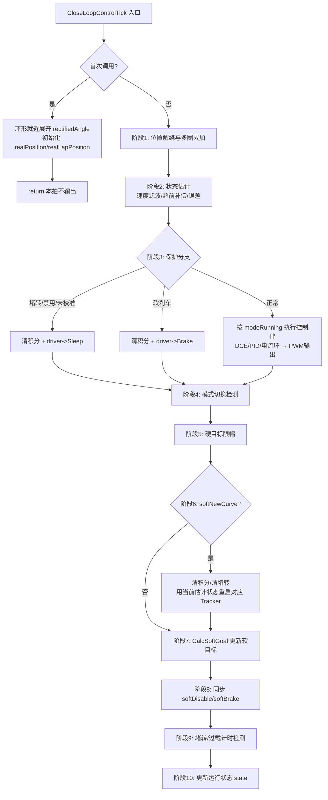

# Motor::CloseLoopControlTick() 函数详解

> 源文件：`dummy-42motor-fw/Ctrl/Motor/motor.cpp` L29-L335
> 关联文件：`motion_planner.h/.cpp`、`motor.h`、`mt6816_base.cpp`、`tb67h450_base.cpp`

---

## 1. 函数定位与调用上下文

`CloseLoopControlTick()` 是整个固件的**核心闭环控制函数**，由 TIM4 定时器中断以 **20 kHz（周期 50 µs）** 调用：

```cpp
void Motor::Tick20kHz()
{
    // 1.编码器数据更新
    encoder->UpdateAngle();       // SPI 读 MT6816 → rawAngle → 查表得 rectifiedAngle
    // 2.电机控制更新
    CloseLoopControlTick();       // 本函数
}
```

每拍执行一次完整的：**读反馈 → 状态估计 → 保护判断 → 控制律计算 → PWM 输出 → 运动规划 → 状态机更新** 流水线。

### 单位约定（贯穿全文）

| 常量 | 值 | 含义 |
|---|---|---|
| `MOTOR_ONE_CIRCLE_HARD_STEPS` | 200 | 1.8° 步进电机一圈整步数 |
| `SOFT_DIVIDE_NUM` | 256 | 微步细分数 |
| `MOTOR_ONE_CIRCLE_SUBDIVIDE_STEPS` | 51200 | 一圈微步总数（位置单位） |
| `CONTROL_FREQUENCY` | 20000 Hz | 控制环频率 |
| `CONTROL_PERIOD` | 50 µs | 控制环周期 |

- 位置单位：微步计数（51200 = 1 圈）
- 速度单位：微步/秒（51200 = 1 r/s）
- 电流单位：mA

### 数据流总览

```text
                ┌─────────────────────────────────────────────────────────────┐
  目标层        │ goalXxx (用户指令) ──限幅──> Tracker.CalcSoftGoal ──> softXxx │
                └─────────────────────────────────────────────────────────────┘
                                                            │
                                                            ▼
                ┌─────────────────────────────────────────────────────────────┐
  控制层        │ estError = softPosition − estPosition                       │
                │ DCE/PID/电流环 ──> focCurrent ──> SetFocCurrentVector(PWM)  │
                └─────────────────────────────────────────────────────────────┘
                                                            ▲
                ┌─────────────────────────────────────────────────────────────┐
  反馈层        │ rectifiedAngle ──解绕──> realPosition ──滤波/超前──> estXxx │
                └─────────────────────────────────────────────────────────────┘
```

核心思想：**三级缓冲**。`goalXxx`（硬目标，来自通信指令）→ 经运动规划平滑成 `softXxx`（软目标，带加减速斜坡）→ 控制环跟踪 `softXxx` 输出 PWM。这样通信指令的突变不会直接冲击控制环。

---

## 2. 整体流程图



---

## 3. 逐段详解

### 阶段 0：首次调用初始化（L31-L59）

```cpp
static bool isFirstCalled = true;
if (isFirstCalled)
{
    int32_t angle;
    if (config.motionParams.encoderHomeOffset < MOTOR_ONE_CIRCLE_SUBDIVIDE_STEPS / 2)
    {
        angle = encoder->angleData.rectifiedAngle >
                config.motionParams.encoderHomeOffset + MOTOR_ONE_CIRCLE_SUBDIVIDE_STEPS / 2 ?
                encoder->angleData.rectifiedAngle - MOTOR_ONE_CIRCLE_SUBDIVIDE_STEPS :
                encoder->angleData.rectifiedAngle;
    } else
    {
        angle = encoder->angleData.rectifiedAngle <
                config.motionParams.encoderHomeOffset - MOTOR_ONE_CIRCLE_SUBDIVIDE_STEPS / 2 ?
                encoder->angleData.rectifiedAngle + MOTOR_ONE_CIRCLE_SUBDIVIDE_STEPS :
                encoder->angleData.rectifiedAngle;
    }

    controller->realLapPosition = angle;
    controller->realLapPositionLast = angle;
    controller->realPosition = angle;
    controller->realPositionLast = angle;

    isFirstCalled = false;
    return;
}
```

**目的**：建立多圈位置的初始基准，之后 `return` 直接退出，第一拍不执行任何控制输出。

**原理**：
- `rectifiedAngle` 是单圈绝对值，范围 `[0, 51200)`，转一圈回绕一次；`encoderHomeOffset`（用户机械零点）也在同一范围。
- 正常运行时多圈位置靠"相邻差值累加"维护，但上电第一拍没有历史值，必须先给 `realPosition` 一个初值。
- 该初值取与当前 `rectifiedAngle` **同余（模 51200）**、且与 `encoderHomeOffset` **环形距离最近**（≤ 半圈 25600）的那个表示：
  - `offset < 25600` 时回绕危险区在高端：若 `rectifiedAngle > offset + 25600`，减 51200（变为负值紧邻零点）；
  - `offset ≥ 25600` 时回绕危险区在低端：若 `rectifiedAngle < offset − 25600`，加 51200。
- 效果：上电后用户坐标系位置必然落在 `[-0.5, +0.5)` 圈，不会出现假跳变；同时 `Last` 副本一并赋值，下一拍的差量计算即可成立。

---

### 阶段 1：位置解绕与多圈累加（L61-L77）

```cpp
int32_t deltaLapPosition;

// Read Encoder data
controller->realLapPositionLast = controller->realLapPosition;
controller->realLapPosition = encoder->angleData.rectifiedAngle;

// Lap-Position calculate
deltaLapPosition = controller->realLapPosition - controller->realLapPositionLast;
if (deltaLapPosition > MOTOR_ONE_CIRCLE_SUBDIVIDE_STEPS >> 1)
    deltaLapPosition -= MOTOR_ONE_CIRCLE_SUBDIVIDE_STEPS;
else if (deltaLapPosition < -MOTOR_ONE_CIRCLE_SUBDIVIDE_STEPS >> 1)
    deltaLapPosition += MOTOR_ONE_CIRCLE_SUBDIVIDE_STEPS;

// Naive-Position calculate
controller->realPositionLast = controller->realPosition;
controller->realPosition += deltaLapPosition;
```

**目的**：把单圈回绕的编码器读数还原成无界的多圈位置。

**原理（相位解绕，Phase Unwrapping）**：
- 20 kHz 采样下，即使 30 r/s 的最高转速，一拍也只移动 `51200×30/20000 = 76.8` 个计数，远小于半圈 25600。因此真实位移一定是落在 `[-25600, +25600)` 内的那个差值。
- 若 `delta > 25600`：说明在 0 点**向下回绕**了（如 100 → 51100，实际是 −100 方向走了 100），减一圈修正；
- 若 `delta < −25600`：说明在 51200 处**向上回绕**，加一圈修正。
- 修正后的 `deltaLapPosition` 累加到 `realPosition`，得到可无限增长/减少的多圈绝对位置。

> 注意：C/C++ 中一元负号优先级高于 `>>`，`-MOTOR_ONE_CIRCLE_SUBDIVIDE_STEPS >> 1` 等价于 `(-51200) >> 1 = -25600`，逻辑正确。

---

### 阶段 2：状态估计（L79-L93）

#### 2.1 速度估计——定点一阶 IIR 低通滤波（L81-L86）

```cpp
controller->estVelocityIntegral += (
    (controller->realPosition - controller->realPositionLast) * motionPlanner.CONTROL_FREQUENCY
    + ((controller->estVelocity << 5) - controller->estVelocity)
);
controller->estVelocity = controller->estVelocityIntegral >> 5;
controller->estVelocityIntegral -= (controller->estVelocity << 5);
```

**目的**：由位置差分估计速度，并滤波抑制编码器量化噪声。

**原理**：
- 瞬时速度 `x = Δpos × 20000`（把"每拍位移"换算成"每秒位移"），噪声极大（低速时一拍 0、一拍 1 跳动）。
- 该写法等价于一阶 IIR 低通：

  \[
  v_{new} = \frac{x + 31 \cdot v_{old}}{32} = v_{old} + \frac{x - v_{old}}{32}
  \]

  即滤波系数 `α = 1/32`，等效时间常数约 `32 拍 = 1.6 ms`。
- `estVelocityIntegral` 充当**定点小数余数累加器**：`>> 5` 截断丢失的余数保留在积分变量里，下一拍继续参与运算，避免纯整数除法的长期累积误差（这是无 FPU 场景下常用的定点技巧）。

#### 2.2 超前角补偿（L88-L90）

```cpp
controller->estLeadPosition = Controller::CompensateAdvancedAngle(controller->estVelocity);
controller->estPosition = controller->realPosition + controller->estLeadPosition;
```

**目的**：补偿高速时磁编码器采样滞后带来的相位延迟。

**原理**：`CompensateAdvancedAngle()`（L525-L552）是一张分段线性插值表：速度越高，往前补偿越多计数（相当于把位置读数"提前"一点），最大补偿 ±430 计数（约 0.84 微步/3°电角以内）。补偿后的 `estPosition` 才是控制环实际跟踪的反馈量，可显著改善高速跟随精度。

#### 2.3 误差计算（L92-L93）

```cpp
controller->estError = controller->softPosition - controller->estPosition;
```

即 `estError = softPosition − estPosition`：软目标位置与估计位置之差，供外部观测/调试（本函数内的 DCE 内部会重新计算 `pError`）。

---

### 阶段 3：控制环输出分派（L95-L144）

```cpp
if (controller->isStalled || controller->softDisable || !encoder->IsCalibrated())
{
    controller->ClearIntegral();    // 清积分
    controller->focPosition = 0;    // 清输出
    controller->focCurrent = 0;
    driver->Sleep();                // 驱动器进入高阻睡眠
} else if (controller->softBrake)
{
    controller->ClearIntegral();
    controller->focPosition = 0;
    controller->focCurrent = 0;
    driver->Brake();                // 驱动器短路刹车
} else
{
    switch (controller->modeRunning) { ... }
}
```

**三个安全分支（优先级从高到低）**：

| 条件 | 动作 | 目的 |
|---|---|---|
| 堵转标志 / 软禁用 / 编码器未校准 | 清积分 + `Sleep()` | 切断输出保护电机；清积分防止恢复时积分饱和冲击 |
| 软刹车 | 清积分 + `Brake()` | 短接绕组实现电磁制动，快速锁轴 |

**正常分支按模式分派控制律**：

| 模式 | 控制律 | 说明 |
|---|---|---|
| `MODE_STEP_DIR` / 各位置模式 | `CalcDceToOutput(softPosition, softVelocity)` | 位置双闭环（DCE） |
| `MODE_COMMAND_VELOCITY` / `MODE_PWM_VELOCITY` | `CalcPidToOutput(softVelocity)` | 速度 PID |
| `MODE_COMMAND_CURRENT` / `MODE_PWM_CURRENT` | `CalcCurrentToOutput(softCurrent)` | 电流直通（开环给定） |
| `MODE_STOP` | `driver->Sleep()` | 停转 |

#### DCE 位置环原理（`CalcDceToOutput`，L382-L412）

```text
pError = 限幅(softPosition − estPosition, ±3200)      // 位置误差限幅 ±1/16 圈
vError = (softVelocity − estVelocity) >> 7，限幅 ±4000
output = (kp·pError + ∫(ki·pError + kv·vError) + kd·vError) >> 10
```

- 位置 P + 速度 KV 阻尼 + 位置积分 KI（带 anti-windup 限幅至 `ratedCurrent<<10`）+ 速度微分 KD；
- 积分项同样用"整圈/余数"定点技巧累加，避免丢精度；
- 输出限幅至 ±`ratedCurrent`，得到 `focCurrent`。

#### 电流矢量输出（`CalcCurrentToOutput`，L338-L349）

```cpp
if (focCurrent > 0)  focPosition = estPosition + SOFT_DIVIDE_NUM;  // 电角度超前 90°
else if (focCurrent < 0) focPosition = estPosition - SOFT_DIVIDE_NUM;
driver->SetFocCurrentVector(focPosition, focCurrent);
```

**FOC 原理**：步进电机两相绕组等效为 PMSM，力矩 = 电流矢量与转子磁场正交分量。`SOFT_DIVIDE_NUM = 256` 计数 = 一个整步 = 90° 电角度；正电流时把电流矢量放在转子位置**前方 90°**，负电流放后方 90°，保证力矩方向与电流符号一致（简化版 FOC：d 轴电流恒为 0，只控 q 轴）。驱动器再根据 `focPosition` 做 sin/cos 分解输出两相 PWM。

> 时序细节：本阶段使用的 `softPosition` 是**上一拍**阶段 7 算出的值（软目标在输出之后才更新），存在一拍（50 µs）延迟，对 20 kHz 环路可忽略。

---

### 阶段 4：模式切换检测（L146-L151）

```cpp
if (controller->modeRunning != controller->requestMode)
{
    controller->modeRunning = controller->requestMode;
    controller->softNewCurve = true;
}
```

`requestMode` 由通信接口（CAN/UART）异步写入。检测到切换后立即置 `softNewCurve`，触发阶段 6 以当前运动状态为起点重新规划，避免新旧模式间目标跳变。

---

### 阶段 5：硬目标限幅（L153-L161）

```cpp
if (controller->goalVelocity > config.motionParams.ratedVelocity) ...
if (controller->goalCurrent > config.motionParams.ratedCurrent) ...
```

对用户层写入的 `goalVelocity` / `goalCurrent` 做**双向钳位**到额定值，保证任何非法指令都不会突破机械/电气极限。

---

### 阶段 6：运动规划重启（L163-L209）

```cpp
if ((controller->softDisable && !controller->goalDisable) ||
    (controller->softBrake && !controller->goalBrake))
    controller->softNewCurve = true;

if (controller->softNewCurve)
{
    controller->softNewCurve = false;
    controller->ClearIntegral();
    controller->ClearStallFlag();
    switch (controller->modeRunning)
    {
        case MODE_COMMAND_POSITION:
            motionPlanner.positionTracker.NewTask(estPosition, estVelocity);
            break;
        ...
        case MODE_STEP_DIR:
            motionPlanner.positionInterpolator.NewTask(estPosition, estVelocity);
            controller->goalPosition = controller->estPosition;  // 增量模式就地保持
            break;
    }
}
```

**触发条件**：模式切换（阶段 4）、或从禁用/刹车状态恢复（此时积分已被清空，规划器必须重新对齐）。

**动作**：清控制积分、清堵转标志，然后按当前模式调用对应 Tracker 的 `NewTask(estPosition, estVelocity)`——**以当前真实估计状态为起点**重建规划曲线，实现"无扰动切换"（bumpless transfer）。

**五种规划器**（`motion_planner.h`）：

| 规划器 | 服务模式 | 作用 |
|---|---|---|
| `positionTracker` | 位置模式 | 梯形加减速：从当前速度加速至额定、匀速、按剩余距离计算减速点 |
| `velocityTracker` | 速度模式 | 按加速度斜坡逼近目标速度 |
| `currentTracker` | 电流模式 | 按电流变化率斜坡逼近目标电流 |
| `trajectoryTracker` | 轨迹模式 | 外部周期性下发位置+速度设定点，超时(200ms)自动减速停车 |
| `positionInterpolator` | STEP/DIR | 把脉冲计数平滑插值为连续位置目标 |

---

### 阶段 7：软目标更新（L211-L254）

```cpp
switch (controller->modeRunning)
{
    case MODE_COMMAND_POSITION:
        motionPlanner.positionTracker.CalcSoftGoal(controller->goalPosition);
        controller->softPosition = motionPlanner.positionTracker.go_location;
        controller->softVelocity = motionPlanner.positionTracker.go_velocity;
        break;
    ...
}
```

每拍调用当前模式规划器的 `CalcSoftGoal(goal)`，把硬目标转换成**本拍的平滑中间目标** `softXxx`。这是阶段 3 控制环下一拍要跟踪的值。规划器内部同样使用定点积分（速度积分得位置、加速度积分得速度），实现恒加减速斜坡。

---

### 阶段 8：软标志同步（L256-L257）

```cpp
controller->softDisable = controller->goalDisable;
controller->softBrake = controller->goalBrake;
```

将通信层写入的禁用/刹车目标同步到软标志，下一拍阶段 3 即生效（结合阶段 6 的恢复检测形成完整闭环）。

---

### 阶段 9：保护检测（L259-L298）

#### 9.1 堵转检测（需 `stallProtectSwitch` 使能）

```cpp
if ( (电流模式 && focCurrent != 0) || (其他模式 && |focCurrent| == ratedCurrent) )
{
    if (abs(estVelocity) < MOTOR_ONE_CIRCLE_SUBDIVIDE_STEPS / 5)   // < 0.2 r/s
    {
        if (stalledTime >= 1000*1000) isStalled = true;            // 累计满 1 s
        else stalledTime += CONTROL_PERIOD;                        // 每拍 +50 µs
    }
} else stalledTime = 0;
```

**判据**：电流已经顶到极限（堵转特征：大电流 + 低速度，速度阈值 10240 计数/s = 0.2 r/s）却转不动，持续 1 秒判定堵转。堵转后阶段 3 会切断输出，**只能手动清除**（`ClearStallFlag` 由重新下发运动指令触发）。

#### 9.2 过载检测

```cpp
if (非电流模式 && |focCurrent| == ratedCurrent) { overloadTime 累加，满 1 s 置 overloadFlag; }
else { 清零并自动清除标志; }
```

与堵转类似但不要求低速条件；负载释放后**自动恢复**。

---

### 阶段 10：状态机更新（L300-L334）

按优先级刷新对外状态 `controller->state`：

```text
未校准 → STATE_NO_CALIB          (最高优先级)
停机   → STATE_STOP
堵转   → STATE_STALL
过载   → STATE_OVERLOAD
否则按模式判断：
  位置模式: softPosition == goalPosition && softVelocity == 0 → STATE_FINISH，否则 STATE_RUNNING
  速度模式: softVelocity == goalVelocity                      → STATE_FINISH，否则 STATE_RUNNING
  电流模式: softCurrent == goalCurrent                        → STATE_FINISH，否则 STATE_RUNNING
```

`STATE_FINISH` 的语义是**规划器已到达目标**（软目标追平硬目标），通信接口据此回复"运动完成"标志。

---

## 4. 计算原理汇总

| 技术点 | 位置 | 原理 |
|---|---|---|
| 环形就近展开 | L35-L50 | 模 51200 同余表示中选取离 home offset 最近的值，保证初始位置在 ±半圈内 |
| 相位解绕 | L69-L73 | 采样率足够高时真实位移必在 ±半圈内，据此修正回绕 |
| 定点 IIR 滤波 | L81-L86 | `v += (x−v)/32`，余数保留在积分变量中防累积误差 |
| 超前角补偿 | L89 | 分段线性表补偿高速传感器相位滞后，最大 ±430 计数 |
| DCE 双闭环 | `CalcDceToOutput` | 位置 P + 速度 KV/KD + 位置积分 KI，带误差限幅与积分 anti-windup |
| 简化 FOC | `CalcCurrentToOutput` | 电流矢量置于转子 ±90° 电角（q 轴控制），`SOFT_DIVIDE_NUM`=256=90° |
| 三级目标缓冲 | 全函数 | goal（指令）→ soft（规划）→ foc（输出），逐级平滑抗突变 |
| 无扰动切换 | L170-L209 | 模式/状态变化时以当前估计值 `NewTask` 重建规划曲线 |

## 5. 关键注意事项

1. **运行环境**：本函数在 TIM4 中断上下文执行，每拍预算 50 µs，全部采用整数定点运算（仅 `SetPositionSetPointWithTime` 等慢速路径用浮点）。
2. **一拍延迟**：阶段 3 使用上一拍的 `softXxx`，阶段 7 的结果下一拍才生效，属有意设计。
3. **未校准保护**：`IsCalibrated()` 为 false 时持续 Sleep，电机无法闭环，需先执行编码器校准（见 `encoder_calibrator_base.cpp`）。
4. **堵转标志需手动清除**；过载标志可自动恢复。
5. 函数内 `static bool isFirstCalled` 保证初始化只执行一次（单实例裸机环境）。
